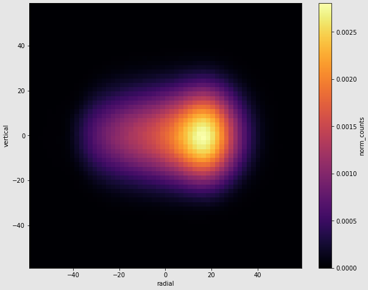

## Jason Bono

I build AI-native products, and I think like a physicist. Co-Founder and CTO of Lucor AI.

Most of what I have built lives behind security or IP walls. Here are a few you can read:

- **[giftaro-public](https://github.com/jasonbono/giftaro-public)**: the code behind
  [Giftaro](https://giftaro.app), a production group-gifting web app (Next.js, React,
  Stripe Connect, Turso/Drizzle). Built with Claude Code, which is how I ship now.
  Published as a sanitized snapshot of real production code.

  

- **[ThoughtKeeper](https://github.com/jasonbono/ThoughtKeeper)**: an AI-native
  thought-capture app (Next.js 16, React 19, local-first SQLite, Anthropic + OpenAI).
  Hybrid full-text and vector search with an agentic, tool-using assistant.

- **[muon-field-averaging](https://github.com/jasonbono/muon-field-averaging)**: physics
  analysis from Fermilab's Muon g-2 experiment (recognized by the 2026 Breakthrough Prize
  in Fundamental Physics). It computes the muon-weighted average magnetic field by convolving
  the measured beam distribution with the field map. Original methods, full systematics
  treatment (Python, Jupyter).

  

[Google Scholar](https://scholar.google.com/citations?user=_uqbi1QAAAAJ&hl=en) ·
[ORCID](https://orcid.org/0000-0002-3018-714X) ·
[LinkedIn](https://www.linkedin.com/in/jasonbono) · jasonbono@lucor.ai
